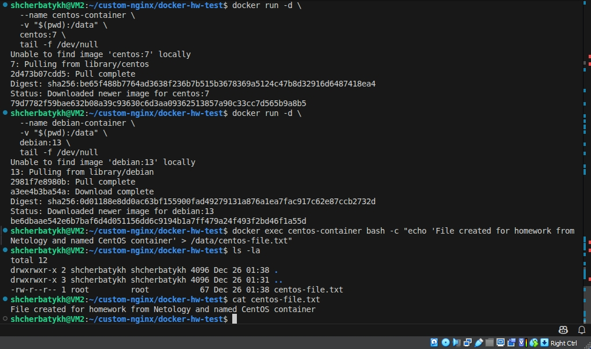
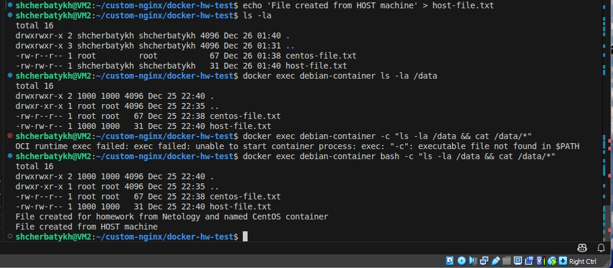

## Домашнее задание к занятию 4 «Оркестрация группой Docker контейнеров на примере Docker Compose»

### Задача 1

Сценарий выполнения задачи:

- Установите docker и docker compose plugin на свою linux рабочую станцию или ВМ.
- Если dockerhub недоступен создайте файл /etc/docker/daemon.json с содержимым: {"registry-mirrors": ["https://mirror.gcr.io", "https://daocloud.io", "https://c.163.com/", "https://registry.docker-cn.com"]}
- Зарегистрируйтесь и создайте публичный репозиторий с именем "custom-nginx" на https://hub.docker.com (ТОЛЬКО ЕСЛИ У ВАС ЕСТЬ ДОСТУП);
- скачайте образ nginx:1.29.0;
- Создайте Dockerfile и реализуйте в нем замену дефолтной индекс-страницы(/usr/share/nginx/html/index.html), на файл index.html с содержимым:

```bash
<html>
<head>
Hey, Netology
</head>
<body>
<h1>I will be DevOps Engineer!</h1>
</body>
</html>
```

- Соберите и отправьте созданный образ в свой dockerhub-репозитории c tag 1.0.0 (ТОЛЬКО ЕСЛИ ЕСТЬ ДОСТУП).
- Предоставьте ответ в виде ссылки на https://hub.docker.com/<username_repo>/custom-nginx/general .

### Решение 1.

Установил docker и docker compose


- Скачал образ nginx:1.29.0.
- Создал ```index.html``` c содержимым из задания.
- Создал ```dockerfile``` в котором реализовал замену дефолтной стартовой страницы на созданную.


- Собрал и отправил созданный образ в свой dockerhub-репозиторий c tag 1.0.0


[Ссылка на репозиторий](https://hub.docker.com/repository/docker/anton13th/custom-nginx/general)

---

### Задача 2

Запустите ваш образ custom-nginx:1.0.0 командой docker run в соответвии с требованиями:
- имя контейнера "ФИО-custom-nginx-t2"
- контейнер работает в фоне
- контейнер опубликован на порту хост системы 127.0.0.1:8080
  
Не удаляя, переименуйте контейнер в "custom-nginx-t2"

Выполните команду date +"%d-%m-%Y %T.%N %Z" ; sleep 0.150 ; docker ps ; ss -tlpn | grep 127.0.0.1:8080  ; docker logs custom-nginx-t2 -n1 ; docker exec -it custom-nginx-t2 base64 /usr/share/nginx/html/index.html

Убедитесь с помощью curl или веб браузера, что индекс-страница доступна.

В качестве ответа приложите скриншоты консоли, где видно все введенные команды и их вывод.


### Решение 2.

Запустил образ с соблюдением требований в задании


Проверим через браузер


Выполнил команду из задания 

```date +"%d-%m-%Y %T.%N %Z" ; sleep 0.150 ; docker ps ; ss -tlpn | grep 127.0.0.1:8080  ; docker logs custom-nginx-t2 -n1 ; docker exec -it custom-nginx-t2 base64 /usr/share/nginx/html/index.html```

Результат выполнения команды


Проверяем доступность индекс-страницы через браузер


и через ```curl```


---

### Задача 3

1. Воспользуйтесь docker help или google, чтобы узнать как подключиться к стандартному потоку ввода/вывода/ошибок контейнера "custom-nginx-t2".
2. Подключитесь к контейнеру и нажмите комбинацию Ctrl-C.
3. Выполните docker ps -a и объясните своими словами почему контейнер остановился.
4. Перезапустите контейнер
5. Зайдите в интерактивный терминал контейнера "custom-nginx-t2" с оболочкой bash.
6. Установите любимый текстовый редактор(vim, nano итд) с помощью apt-get.
7. Отредактируйте файл "/etc/nginx/conf.d/default.conf", заменив порт "listen 80" на "listen 81".
8. Запомните(!) и выполните команду nginx -s reload, а затем внутри контейнера curl http://127.0.0.1:80 ; curl http://127.0.0.1:81.
9. Выйдите из контейнера, набрав в консоли exit или Ctrl-D.
10. Проверьте вывод команд: ss -tlpn | grep 127.0.0.1:8080 , docker port custom-nginx-t2, curl http://127.0.0.1:8080. Кратко объясните суть возникшей проблемы.
11. - Это дополнительное, необязательное задание. Попробуйте самостоятельно исправить конфигурацию контейнера, используя доступные источники в интернете. Не изменяйте конфигурацию nginx и не удаляйте контейнер. Останавливать контейнер можно. пример источника
12. Удалите запущенный контейнер "custom-nginx-t2", не останавливая его.(воспользуйтесь --help или google)

В качестве ответа приложите скриншоты консоли, где видно все введенные команды и их вывод.


### Решение 3.

1. Подключился к стандартному потоку ввода/вывода/ошибок контейнера "custom-nginx-t2" (команда ```docker attach```)
2. Прервал выполнение комбинацией клавиш **Ctrl-C**
3. Выполнил ```docker ps -a```


**Объяснение:** Контейнер остановился, потому что nginx завершил работу. Когда я подключлся через ```docker attach```, я подключился к процессу **nginx**, а команда **Ctrl+C** отправила сигнал ```SIGINT``` (прерывание) этому процессу. Nginx получил сигнал остановки и завершил работу, что привело к остановке контейнера, так как процесс с **PID=1 (nginx)** завершился.

4. Перезапустил контейнер


5. Зашёл в интерактивный терминал контейнера "custom-nginx-t2" с оболочкой ```bash```
6. Установил текстовый редактор **nano**


7. Отредактировал файл "/etc/nginx/conf.d/default.conf", заменив порт "listen 80" на "listen 81"
8. Выполнил команду ```nginx -s reload```,
   - а затем внутри контейнера ```curl http://127.0.0.1:80```
   - затем  ```curl http://127.0.0.1:81```
9. И вышел из консоли с помощью команды ```exit```
  
   

10. Проверил вывод команд:
    - ```ss -tlpn | grep 127.0.0.1:8080```
    - ```docker port custom-nginx-t2```
    - ```curl http://127.0.0.1:8080.```


#### Объяснение проблемы

- Внутри контейнера я изменил порт прослушивания nginx с 80 на 81
- Снаружи контейнера проброс портов настроен как 127.0.0.1:8080 → 80 (контейнер)
- Контейнер пробрасывает хост-порт 8080 на контейнерный порт 80. Но внутри контейнера nginx теперь слушает на порту 81. Получается разрыв связи: запросы с хоста на 127.0.0.1:8080 перенаправляются на порт 80 контейнера, но там ничего не слушает.
- Результат: curl http://127.0.0.1:8080 возвращает ошибку соединения.
  

11. Docker не позволяет напрямую изменять проброс портов у запущенного контейнера, но можно создать новый контейнер из существующего с новыми параметрами.

- Останавливаем контейнер ```docker stop custom-nginx-t2```
- Сохраняем текущее состояние контейнера в новый образ ```docker commit custom-nginx-t2 custom-nginx-port-81```
- Запускаем новый контейнер с правильным пробросом портов ```docker run -d --name custom-nginx-t2-fixed -p 127.0.0.1:8080:81 custom-nginx-port-81```


  
- Пробую переименовать новый контейнер ```docker rename custom-nginx-t2-fixed custom-nginx-t2``` . **НЕУДАЧНО.** При существующем контейнере **custom-nginx-t2** переименовать не получилось. Оставляю первый "старый" контейнер в остановленном состоянии, работаю с "новым". Делаю вывод, что в Docker нельзя иметь два контейнера с одинаковым именем, даже если один из них остановлен. Нужно сначала освободить имя.
- Проверяю работу нового контейнера ```docker exec custom-nginx-t2-fixed curl -s http://127.0.0.1:81```


12. Удаляю запущенный контейнер "custom-nginx-t2", не останавливая его. Это возмоэжно выполнить с помощью команды ```docker rm -f custom-nginx-t2``` (с флагом ```-f``` (force)).

Проверяю, что контейнер удалён ```docker ps -a | grep custom-nginx-t2```


---

### Задача 4

- Запустите первый контейнер из образа centos c любым тегом в фоновом режиме, подключив папку текущий рабочий каталог $(pwd) на хостовой машине в /data контейнера, используя ключ -v.
- Запустите второй контейнер из образа debian в фоновом режиме, подключив текущий рабочий каталог $(pwd) в /data контейнера.
- Подключитесь к первому контейнеру с помощью docker exec и создайте текстовый файл любого содержания в /data.
- Добавьте ещё один файл в текущий каталог $(pwd) на хостовой машине.
- Подключитесь во второй контейнер и отобразите листинг и содержание файлов в /data контейнера.

В качестве ответа приложите скриншоты консоли, где видно все введенные команды и их вывод.

### Решение 4.

1. Запустил контейнер из образа **centos 7** c любым тегом в фоновом режиме, подключив папку текущий рабочий каталог $(pwd) на хостовой машине в /data контейнера, используя ключ -v.
2. Запустил второй контейнер из образа **debian 13** в фоновом режиме, подключив текущий рабочий каталог $(pwd) в /data контейнера.
3. Подключился к первому контейнеру с помощью ```docker exec``` и создал текстовый файл с содержанием "File created for homework from Netology and named CentOS container" в /data.



4. Добавил  ещё один файл в текущий каталог $(pwd) на хостовой машине.
5. Подключился во второй контейнер и отобразил листинг и содержание файлов в /data контейнера.



---

### Задача 5

1. Создайте отдельную директорию(например /tmp/netology/docker/task5) и 2 файла внутри него. "compose.yaml" с содержимым:

```bash
version: "3"
services:
  portainer:
    network_mode: host
    image: portainer/portainer-ce:latest
    volumes:
      - /var/run/docker.sock:/var/run/docker.sock
```

"docker-compose.yaml" с содержимым:

```bash
version: "3"
services:
  registry:
    image: registry:2

    ports:
    - "5000:5000"
```

И выполните команду ```docker compose up -d```. Какой из файлов был запущен и почему? (подсказка: https://docs.docker.com/compose/compose-application-model/#the-compose-file )

2. Отредактируйте файл compose.yaml так, чтобы были запущенны оба файла. (подсказка: https://docs.docker.com/compose/compose-file/14-include/)

3. Выполните в консоли вашей хостовой ОС необходимые команды чтобы залить образ custom-nginx как custom-nginx:latest в запущенное вами, локальное registry. Дополнительная документация: https://distribution.github.io/distribution/about/deploying/

4. Откройте страницу "https://127.0.0.1:9000" и произведите начальную настройку portainer.(логин и пароль адмнистратора)

5. Откройте страницу "http://127.0.0.1:9000/#!/home", выберите ваше local окружение. Перейдите на вкладку "stacks" и в "web editor" задеплойте следующий компоуз:

```bash
version: '3'

services:
  nginx:
    image: 127.0.0.1:5000/custom-nginx
    ports:
      - "9090:80"
```

6. Перейдите на страницу "http://127.0.0.1:9000/#!/2/docker/containers", выберите контейнер с nginx и нажмите на кнопку "inspect". В представлении <> Tree разверните поле "Config" и сделайте скриншот от поля "AppArmorProfile" до "Driver".

7. Удалите любой из манифестов компоуза(например compose.yaml). Выполните команду "docker compose up -d". Прочитайте warning, объясните суть предупреждения и выполните предложенное действие. Погасите compose-проект ОДНОЙ(обязательно!!) командой.

В качестве ответа приложите скриншоты консоли, где видно все введенные команды и их вывод, файл compose.yaml , скриншот portainer c задеплоенным компоузом.

