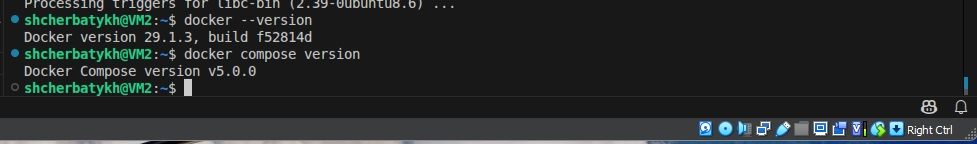
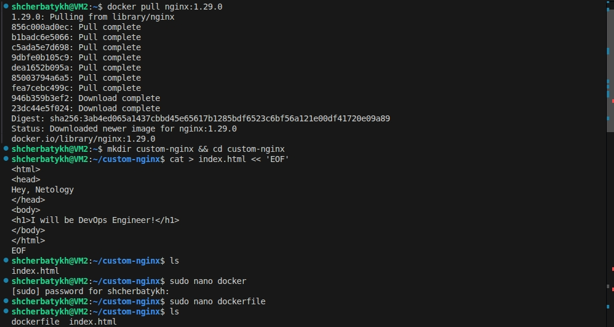
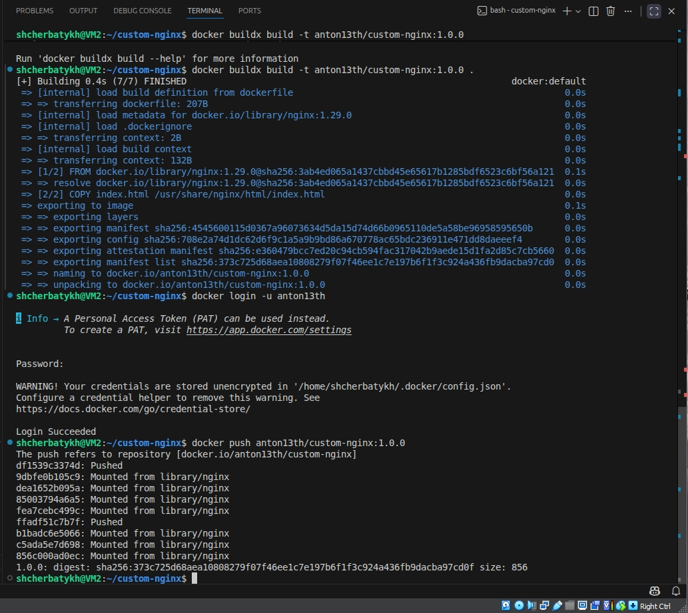
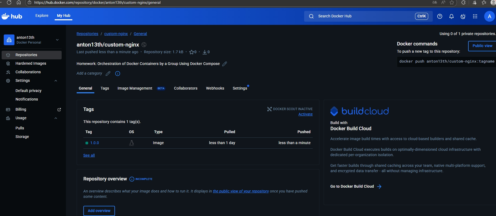
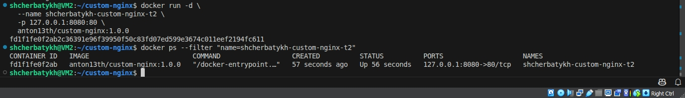
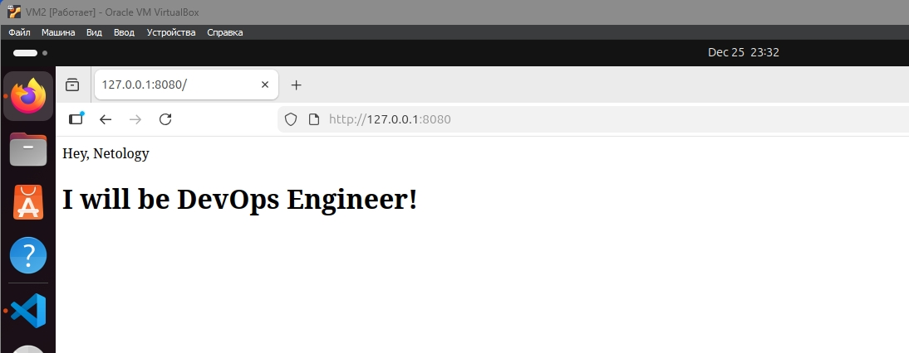
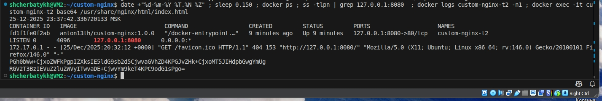
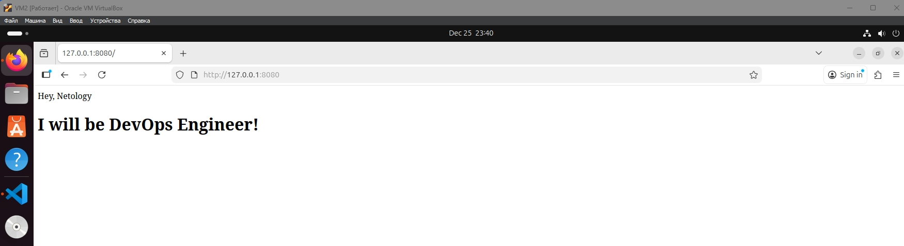
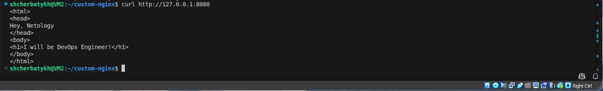

## Домашнее задание к занятию 4 «Оркестрация группой Docker контейнеров на примере Docker Compose»

### Задача 1

Сценарий выполнения задачи:

- Установите docker и docker compose plugin на свою linux рабочую станцию или ВМ.
- Если dockerhub недоступен создайте файл /etc/docker/daemon.json с содержимым: {"registry-mirrors": ["https://mirror.gcr.io", "https://daocloud.io", "https://c.163.com/", "https://registry.docker-cn.com"]}
- Зарегистрируйтесь и создайте публичный репозиторий с именем "custom-nginx" на https://hub.docker.com (ТОЛЬКО ЕСЛИ У ВАС ЕСТЬ ДОСТУП);
- скачайте образ nginx:1.29.0;
- Создайте Dockerfile и реализуйте в нем замену дефолтной индекс-страницы(/usr/share/nginx/html/index.html), на файл index.html с содержимым:

```bash
<html>
<head>
Hey, Netology
</head>
<body>
<h1>I will be DevOps Engineer!</h1>
</body>
</html>
```

- Соберите и отправьте созданный образ в свой dockerhub-репозитории c tag 1.0.0 (ТОЛЬКО ЕСЛИ ЕСТЬ ДОСТУП).
- Предоставьте ответ в виде ссылки на https://hub.docker.com/<username_repo>/custom-nginx/general .

### Решение 1.

Установил docker и docker compose



- Скачал образ nginx:1.29.0.
- Создал ```index.html``` c содержимым из задания.
- Создал ```dockerfile``` в котором реализовал замену дефолтной стартовой страницы на созданную.



- Собрал и отправил созданный образ в свой dockerhub-репозиторий c tag 1.0.0





[Ссылка на репозиторий](https://hub.docker.com/repository/docker/anton13th/custom-nginx/general)

---

### Задача 2

Запустите ваш образ custom-nginx:1.0.0 командой docker run в соответвии с требованиями:
- имя контейнера "ФИО-custom-nginx-t2"
- контейнер работает в фоне
- контейнер опубликован на порту хост системы 127.0.0.1:8080
  
Не удаляя, переименуйте контейнер в "custom-nginx-t2"

Выполните команду date +"%d-%m-%Y %T.%N %Z" ; sleep 0.150 ; docker ps ; ss -tlpn | grep 127.0.0.1:8080  ; docker logs custom-nginx-t2 -n1 ; docker exec -it custom-nginx-t2 base64 /usr/share/nginx/html/index.html

Убедитесь с помощью curl или веб браузера, что индекс-страница доступна.

В качестве ответа приложите скриншоты консоли, где видно все введенные команды и их вывод.


### Решение 2.

Запустил образ с соблюдением требований в задании



Проверим через браузер



Выполнил команду из задания 

```date +"%d-%m-%Y %T.%N %Z" ; sleep 0.150 ; docker ps ; ss -tlpn | grep 127.0.0.1:8080  ; docker logs custom-nginx-t2 -n1 ; docker exec -it custom-nginx-t2 base64 /usr/share/nginx/html/index.html```

Результат выполнения команды



Проверяем доступность индекс-страницы через браузер



и через ```curl```




